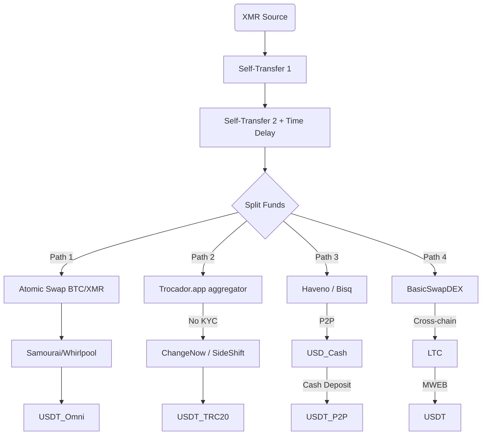

# How to Hide Your XMR from Anyone (or Almost Anyone)?

**Privacy is not a crime. It's an information theory problem.**

People think blockchain is about anonymity. That's nonsense. Blockchain is the most sophisticated surveillance apparatus ever engineered by mankind. It's an eternal ledger that never burns. If you're using Bitcoin, you're essentially writing your financial transactions across the sky in giant neon letters.

Monero (XMR) is an attempt to kill that spotlight. But even in the dark, you can still find someone if they're breathing too loud.

Let's break down how to convert XMR to USDT without leaving digital DNA behind, using your BRAIN (or whatever passes for one) ^_^.

---

## Part 1: The Privacy Landscape. Who's Actually "Naked"?

Before architecting any scheme, you need to understand why other tools fail. **In physics, you can't cheat the laws of thermodynamics. In cryptography, you can't cheat an open ledger.**

We'll compare XMR against three popular "anonymous" competitors. Spoiler: most of them are just marketing fluff.

### 1. Zcash (ZEC): Default Failure
Zcash uses zk-SNARKs — slick math, genuinely powerful stuff. But there's a fundamental engineering flaw: **privacy is optional**.
*   **Problem:** The majority of transactions flow through transparent `t-addresses`. Only [~15% of transactions](https://bithide.io/blog/ru/how-to-trace-monero-and-privacy-coins/) are fully shielded (`z-addresses`).
*   **Result:** If you use a `z-address`, you land in a tiny subset of users. From an entropy standpoint, you stand out *precisely because* you're trying to hide. It's like wearing a ski mask on the beach.

### 2. Dash: The Mixing Illusion
Dash uses CoinJoin (the PrivateSend feature).
*   **Problem:** This isn't cryptographic blindness. It's just a protocol-level mixer. You shuffle your coins with others, but masternodes (the servers processing this) can theoretically observe the linkages.
*   **Result:** The blockchain is transparent. Analytics firms (Chainalysis et al.) learned to unravel these tangles ages ago. As [experts note](https://bithide.io/blog/ru/how-to-trace-monero-and-privacy-coins/), Dash provides no more privacy than Bitcoin with a mixer.

### 3. Verge (XVG): Hiding Your IP, Not Your Money
Verge routes traffic through Tor/I2P.
*   **Problem:** This hides *where* you connected from, but not *how much* and *to whom* you sent. The ledger is fully public [bithide.io](https://bithide.io/blog/ru/how-to-trace-monero-and-privacy-coins/).
*   **Result:** Completely useless for hiding money flows.

**Bottom Line:** Only Monero (XMR) provides **privacy by default** (RingCT, stealth addresses, Ring Signatures). In Monero, there are no transparent transactions. Everyone looks the same. This maxes out the "anonymity set."

---

## Part 2: Attack Vectors. How They'll Find You.

Even "bulletproof" XMR has vulnerabilities. If we don't understand the attack vectors, we can't build proper defenses.

### Vector 1: Transaction Graph Collapse (EAE Attack)
This attack is called **Exchange-Address-Exchange**.
1. You withdraw XMR from a KYC exchange (Exchange A) to your wallet.
2. You send XMR to a friend (or to yourself at another exchange).
3. That XMR lands on Exchange B, which cooperates with Exchange A.
4. **Result:** Even if Monero obfuscates the path, Exchange A and Exchange B share databases. If timing and amounts correlate (even accounting for fees) — you're deanonymized.

### Vector 2: Poisoned Output Attack (Dusting)
An attacker (or a three-letter agency) floods the network with millions of tiny transactions they control. When you make a transaction, your wallet picks "decoys" from the blockchain to mix with your real output.
*   **Risk:** If you accidentally pick decoys that belong to the attacker, they know *those* are fake. The only real output — is yours. Elimination math.
*   **Mitigation:** Modern output selection algorithms in Monero (the "gamma" selection algorithm) minimize this risk, but it's not zero.

### Vector 3: Metadata and IP Leaks
This is the easiest approach. Finnish police in the Vastaamo hacker case [traced XMR transactions](https://bithide.io/blog/ru/how-to-trace-monero-and-privacy-coins/) not by breaking the cryptography, but through correlation.
*   **Case:** The hacker sent XMR to Binance. Police subpoenaed the logs.
*   **Pattern:** Blockchain transaction (time X) -> Exchange deposit (time X + confirmations).
*   **Result:** Your IP address leaks at the ISP level if you're not using Tor/I2P or [specialized nodes](https://dtf.ru/crypto/4088409-monero-xmr-osobennosti-i-preimushchestva-samoy-anonimnoy-kriptovalyuty).

---

## Part 3: 50 Shades of Grey (Withdrawal Schemes)

We're not just going to list 50 lines here. We'll build a **scheme generator** based on the principle of entropy maximization.

Your basic objective: `XMR (Wallet A) -> ??? -> USDT (Clean Wallet)`.

### The Concept of "Churning"
Before cashing out, you must break the link to your funds' origin history.
**Rule:** *Never* send XMR straight to an exit point. Send it to yourself 2-5 times. Each transaction changes the set of ring signatures (decoys). This exponentially complicates analysis.

Here's a schematic representation of paths. Mix and match.

#### Group A: DEX and P2P (Maximum Anonymity)
These methods don't require KYC and leave no traces in centralized databases.



**Variations (methods 1-20):**
1.  **Atomic Swaps:** Use `UnstoppableSwap` or `Farcaster`. XMR <-> BTC with no middleman. This is the holy grail. The blockchain sees the swap but can't link participants.
2.  **Aggregators (Tor):** Use aggregators like Trocador via Tor Browser. Pick exchanges with low risk ratings (no KYC).
3.  **DEX (Bisq/Haveno):** P2P exchange into fiat or stables. Main risk here is the counterparty, but blockchain footprint is minimal.
4.  **BasicSwapDEX:** Cross-chain DEX with an order book running on atomic swaps.

#### Group B: Bridges and Offshore CEX (Medium Risk, High Liquidity)
We're using exchanges that "don't ask questions," but keeping the "EAE" risk in mind.

**"Fragment and Delay" Scheme:**
`XMR Main -> 5 Sub-Wallets -> Random Delay (24-168 hours) -> 5 Different Non-KYC Exchanges -> 5 Fresh USDT Wallets`

**Variations (methods 21-40):**
5.  **Exch:** TradeOgre (old school, zero KYC).
6.  **Exch:** MEXC (often no KYC for small amounts, but risky — need a clean IP).
7.  **Exch:** KuCoin (non-KYC limits are trimmed, risk of lockout).
8.  **Chain Hopping:** XMR -> LTC (MWEB) -> USDT. Using Litecoin with MimbleWimble Extension Blocks for an additional obfuscation layer.
9.  **Privacy Bridges:** Secret Network or FIRO. XMR -> Bridge -> sXMR (Secret Monero) -> USDT. (Risk: bridges are centralized).

#### Group C: Physical World (High Overhead, Absolute Anonymity)
**Variations (methods 41-50):**
10. **Gift Cards:** Bitrefill or Coinsbee (buy Amazon/Visa gift cards with XMR, then sell the cards for USDT on Paxful). The % loss is massive, but the trail goes cold completely.
11. **Crypto ATM:** Sell XMR (or swapped LTC) at an ATM for cash. Deposit cash onto a different card -> buy USDT. Chain breakage through an "air gap" (fiat gap).
12. **LocalMonero (RIP) Alternatives:** In-person cash meetings (physically dangerous, cryptographically perfect).

---

## Part 4: Conclusion.

Let's apply a purely mathematical approach to this problem. Forget the "conventional" way. Let's look at the physics of the process.

**Problem:** You have a system state $A$ (XMR) and you want state $B$ (USDT), while maintaining $Link(A, B) = 0$.

**Constraints:**
1.  Every transaction is information. Information cannot be destroyed, only dissolved into noise (entropy).
2.  Any centralized point (Exchange, Bridge) is a data collection point. Trust = Vulnerability.

**Solution:**
1.  **Eliminate trust:** Don't use CEX. Use only code (Atomic Swaps, DEX). If you're using a CEX, you trust their database more than math. That's a bug.
2.  **Maximize noise (Churn):** You must send money to yourself at least $N$ times, where $N$ is large enough that the probability of statistical analysis drops below the significance threshold. Each transfer within XMR expands the tree of possible senders.
3.  **Introduce the Time variable ($t$):** Most deanonymization algorithms hunt for temporal correlations. If you transfer XMR and *instantly* swap to USDT, you're creating a strong time signal.
    *   *Success formula:* `Input time != Output time`. Inject random delays (random delay distribution). Let the funds sit for a week. Entropy grows with time.
4.  **Split amounts ($Volume Correlation$):** Don't convert 1000 XMR into its 1000 USDT equivalent (minus fees).
    *   Break it into random chunks: 134, 52, 210. Route them through different paths.

**Final Algorithm:**
1.  **Generate noise:** 3-4 transactions within the Monero network between your own wallets.
2.  **Kill time:** Wait random intervals (days, not hours).
3.  **Use math, not people:** Atomic swap XMR -> BTC (Native Segwit).
4.  **Wash the BTC traces:** CoinJoin (Whirlpool) for BTC (because BTC is transparent).
5.  **Finale:** BTC -> USDT via a non-custodial exchanger.

This is expensive. This is slow. But it's the only method that **physically** guarantees the link $A \to B$ is indistinguishable from the background noise of the Universe.

Use [this knowledge](https://docs-ru.tornadoether.cash/) wisely.

---

# Thought Process

## The "How to ...?" Question

```
I'm trying to convert XMR to USDT in a way that achieves maximum anonymity
during transfers and minimizes the risk of linking these transactions to me.

Currently, all funds are in a single non-custodial XMR wallet.

I'm planning to withdraw through the following chain:
XMR ID1 -> XMR ID2 & XMR ID3 & XMR ID4 -> DEX-CHANGE -> USDT,
where ID denotes the number of a non-custodial wallet (there are several in the scheme)

Each transaction is executed at a different time

Come up with 25-50 more ways to transfer XMR -> USDT and display them schematically

Consider all possible nuances when working with XMR: study the technical
information and all possible risks before proposing solutions
```

## The Answer

**Problem:** It's not about transferring `XMR` to `USDT`. That's trivial. The real problem is **breaking the information link**. You want the trail from your `XMR` to evaporate the moment they morph into `USDT` on a public blockchain. Anyone analyzing the chain should hit a brick wall.

Your proposed scheme is a solid start. You're instinctively leveraging two fundamental principles: **fragmentation** (splitting amounts) and **hops** (intermediate wallets). But we can make this exponentially harder for any analyst.

Let's break down the variables we can play with:
1.  **Number and type of wallets:** Non-custodial, exchange sub-accounts, hardware.
2.  **Type of exchange platforms:** Instant swaps (no KYC), exchange aggregators, DEX, CEX (with and without KYC), P2P platforms.
3.  **Intermediate assets:** A direct `XMR -> USDT` swap is the easiest to trace. Introducing one or more intermediate assets creates additional breakpoints.
4.  **Blockchain networks:** `USDT` exists on different networks (`ERC-20`, `TRC-20`, `SOL`, etc.). Jumping between networks (cross-chain swaps) is a powerful tool.
5.  **Time and amounts:** Random, non-round amounts and irregular time intervals.

Your scheme is decent, but the weak point is `DEX-CHANGE`. The transaction on a DEX is visible to everyone. If you sent `XMR` to a service that wrapped them and pushed them onto a DEX for exchange, that service is a central point of failure. Its logs can burn you.

Here are 25+ methods, grouped by methodology, from simple to full-paranoia mode.

---

### Category 1: Enhanced Fragmentation and Instant Exchangers

These are variations on your idea, focusing on using services that don't require registration and KYC, as described on [ybex.io](https://ybex.io/ru/blog/exchange-guides/how-to-exchange-xmr-to-usdt).

**Method 1: Classic Breakpoint**
```
XMR W1 -> XMR W_burner -> Instant exchanger (like Ybex) -> USDT W_final (TRC-20)
```
*   **Logic:** The simplest way to sever a direct link. `W_burner` is a "throwaway" wallet for a single op.

**Method 2: Parallel Fragmentation**
```
          /-> XMR W2 -> Exchanger A -> USDT W_final_A (TRC-20) \
XMR W1 -> -- > XMR W3 -> Exchanger B -> USDT W_final_B (ERC-20) --> USDT W_consolidated
          \-> XMR W4 -> Exchanger C -> USDT W_final_C (SOL)    /
```
*   **Logic:** Splitting streams and using different networks for `USDT` massively complicates data consolidation. End wallets are also different, then funds can be collected into one.

**Method 3: Using Aggregators**
```
XMR W1 -> XMR W_burner -> Aggregator (like Swapzone or Bestchange) -> USDT W_final
```
*   **Logic:** Aggregators like [swapzone.io](https://swapzone.io/ru/exchange/usdt/xmr) or [bestchange.ru](https://www.bestchange.ru/tether-trc20-to-monero.html) offer dozens of exchangers to choose from. You can pick the least known one or one that works in manual mode, creating additional delay and uncertainty.

**Method 4: Sequential "Laundering"**
```
XMR W1 -> Exchanger A (-> BTC W2) -> Exchanger B (-> LTC W3) -> Exchanger C (-> USDT W_final)
```
*   **Logic:** A chain of swaps through different assets on different platforms. Expensive due to fees, but effective. An analyst would need to subpoena logs from three different services that might be in different jurisdictions.

**Method 5: Fragmentation + Aggregators**
```
          /-> XMR W2 -> Aggregator A (pick offer #1) -> USDT W_final_A \
XMR W1 -> -- > XMR W3 -> Aggregator B (pick offer #5) -> USDT W_final_B  | Consolidate at different times
          \-> XMR W4 -> Aggregator C (pick offer #3) -> USDT W_final_C /
```
*   **Logic:** Combination of methods 2 and 3. Maximum dispersion across different services.

### Category 2: Using Exchanges (CEX) as "Black Holes"

Exchanges, even with KYC, have enormous liquidity pools that function as giant mixers. As noted on [youtube.com](https://www.youtube.com/watch?v=BFvf-qPxXtA), deposit addresses on exchanges can effectively terminate a trail.

**Method 6: No-KYC CEX**
```
XMR W1 -> XMR W_burner -> CEX (no KYC for small amounts) -> Swap XMR/BTC -> Withdraw BTC to W_clean -> Exchanger -> USDT W_final
```
*   **Logic:** Many exchanges don't require KYC for deposits and trading/withdrawals up to a certain limit (e.g., $1000-$2000 per day). You deposit `XMR`, swap to another asset (`BTC`, `LTC`) and withdraw it. The link between `XMR` and your final `USDT` is severed.

**Method 7: Sub-accounts on CEX**
```
XMR W1 -> CEX (Main account) -> Internal transfer to CEX (Sub-account) -> Swap XMR/USDT -> Withdraw USDT to W_final
```
*   **Logic:** Internal transfers between sub-accounts typically aren't reflected on the blockchain. This creates an "internal" break that's only visible to the exchange itself.

**Method 8: Multi-CEX "Vacuum"**
```
          /-> XMR W2 -> CEX_A (no KYC) -> Withdraw BTC W_clean_A \
XMR W1 -> -- > XMR W3 -> CEX_B (no KYC) -> Withdraw BTC W_clean_B --> Exchanger -> USDT W_final
          \-> XMR W4 -> CEX_C (no KYC) -> Withdraw BTC W_clean_C /
```
*   **Logic:** Similar to method 2, but CEXs instead of exchangers. BTC from three different exchanges gets mixed in one wallet before the final swap.

**Method 9: Deposit -> Trade -> Immediate Withdrawal**
```
XMR W1 -> CEX (with KYC) -> Swap XMR/USDT -> Immediate withdrawal of USDT to W_final (TRC-20)
```
*   **Logic:** You use the exchange as a quick gateway. Your `XMR` goes into the exchange's common pool, and you get "clean" `USDT` from its hot wallet. The risk is that your identity is tied to the operation via KYC. But the fund trail on-chain is interrupted.

### Category 3: Cross-chain and Advanced Assets

The most robust methods, as they force analysts to switch between entirely different blockchain technologies.

**Method 10: Bridge into DeFi**
```
XMR W1 -> Instant exchanger -> renBTC/wBTC (on Ethereum network) -> DeFi protocol (Curve, Uniswap) -> USDT W_final (ERC-20)
```
*   **Logic:** You transform `XMR` into tokenized bitcoin on Ethereum via a bridge service (often a centralized exchanger), then use public DeFi. The break happens at the bridging stage.

**Method 11: Hop Through Another Privacy Coin**
```
XMR W1 -> Exchanger A -> Zcash (ZEC) in a shielded wallet -> Exchanger B -> USDT W_final
```
*   **Logic:** `XMR` -> private blockchain -> `ZEC` -> private blockchain -> `USDT`. Using a shielded (z-addr) Zcash wallet adds another layer of cryptographic anonymity.

**Method 12: Atomic Swaps**
```
XMR W1 -> Atomic Swap Client -> Receive BTC/ETH directly in W_clean -> DEX/Exchanger -> USDT W_final
```
*   **Logic:** Theoretically, the cleanest approach. Decentralized exchange with no middlemen. In practice, finding a counterparty for an `XMR` atomic swap is tricky, but the technology exists.

**Method 13: Using THORChain/Similar DEXs**
```
XMR W1 -> THORChain interface -> Swap to native BTC/ETH -> DEX/Exchanger -> USDT W_final
```
*   **Logic:** Cross-chain DEXs like THORChain use liquidity pools to swap native assets. This is a decentralized way to jump from the Monero blockchain to Bitcoin/Ethereum.

**Method 14: Routing Through the Cosmos Ecosystem**
```
XMR W1 -> Exchanger -> ATOM W_cosmos -> Osmosis (DEX on Cosmos network) -> Swap ATOM to axlUSDT -> Axelar Bridge -> USDT W_final (on Ethereum)
```
*   **Logic:** A very complex chain involving multiple blockchains and bridges. Tracing something like this is virtually impossible.

### Category 4: P2P and Indirect Methods

Here we completely avoid automated services and step into the "real world."

**Method 15: Classic P2P**
```
XMR W1 -> P2P platform (LocalMonero, Bisq) -> Sell XMR for fiat (card/bank transfer) -> Buy USDT on a P2P marketplace of another exchange
```
*   **Logic:** Complete chain break. You sell `XMR` to one person, and buy `USDT` from another for fiat. There's no connection between these two crypto operations whatsoever.

**Method 16: P2P with Intermediate Asset**
```
XMR W1 -> P2P (LocalMonero) -> Sell XMR for BTC -> BTC W_clean -> P2P (on Binance/Bybit) -> Sell BTC for USDT
```
*   **Logic:** You don't touch fiat. Swap `XMR` for `BTC` with one user, then `BTC` for `USDT` with another.

**Method 17: Gift Cards**
```
XMR W1 -> Service (like Bitrefill) -> Buy gift card (Amazon, etc.) with XMR -> Sell gift card code on P2P market (Paxful) for USDT
```
*   **Logic:** Introducing a non-financial asset (gift card) as an intermediate link.

### Category 5: "Paranoid" Methods

Combining everything above for maximum security.

**Method 18: Mixer + CEX**
```
XMR W1 -> Exchanger -> BTC W_dirty -> BTC Mixer (CoinJoin, e.g., Wasabi/Samourai) -> BTC W_clean -> CEX (no KYC) -> USDT W_final
```
*   **Risk:** Using mixers can "tag" your coins, and some exchanges might reject them. High risk, but also high degree of anonymity.

**Method 19: Chain + Fragmentation + Different Networks**
```
                    /-> XMR W2 -> Exchanger A -> LTC W_A -> Exchanger B -> USDT(TRC-20) W_A \
XMR W1 -> (Day 1) -- > XMR W3 -> Exchanger C -> BTC W_B -> Exchanger D -> USDT(ERC-20) W_B  |-> Consolidate in
                    \-> (Day 2) -> XMR W4 -> Exchanger E -> ETH W_C -> DEX (Uniswap) -> USDT(ERC-20) W_C  /   final W
```
*   **Logic:** Combination of multiple complex techniques in one scheme.

**Methods 20-25+ (Variations):**

20.  **Lightning Network:** `XMR -> Exchanger -> BTC (to Lightning wallet) -> Withdraw from LN to regular BTC address -> Exchanger -> USDT`. The Lightning Network adds its own privacy layer.
21.  **DeFi Loans:** `XMR -> Exchanger -> ETH -> Aave/Compound (provide ETH as collateral) -> Take out a loan in USDT`. Repaying the loan is optional. You essentially "sold" ETH for USDT through the protocol.
22.  **Synthetic Assets:** `XMR -> Exchanger -> ETH -> Synthetix -> Mint sUSD (synthetic dollar) -> Swap for USDT`.
23.  **Cash Exit:** `XMR -> P2P -> Sell for cash -> Buy USDT for cash via another P2P service`. Maximum anonymity, but also maximum real-world risks.
24.  **Using Monero DEX:** `XMR W1 -> Haveno/SeraiDEX -> Swap for wBTC/other asset -> Bridge -> USDT`.
25.  **CEX + DEX Combo:** `XMR W1 -> CEX (no KYC) -> LTC -> Withdraw to W_clean -> Bridge to Polygon network -> QuickSwap DEX -> USDT (Polygon)`.

---

### Fundamental XMR Risks and Nuances

*   **Metadata Analysis:** Even in Monero, if you send funds from one wallet to 10 others within 5 minutes, and an hour later swaps to USDT start from those 10 wallets, the temporal correlation is obvious. **Always use large random time delays (hours, days).**
*   **"Poisoned" Coins from Exchanges:** If you withdraw `XMR` from a major exchange and then immediately try to anonymize, your withdrawal is already tied to your KYC account. Anonymous wallet first — then operations.
*   **Fixed/Floating Rate:** Aggregators like [swapzone.io](https://swapzone.io/ru/exchange/usdt/xmr) offer a choice between fixed and floating rates. For anonymity, the floating rate might be better — the final amount will be less predictable and harder to correlate.
*   **Exchanger Risks:** Instant exchangers can introduce KYC at any moment, demand AML verification, or just straight-up steal your funds. Always use vetted services (e.g., through aggregators with reviews, like [bestchange.ru](https://www.bestchange.ru/tether-trc20-to-monero.html)) and split large amounts.
*   **Fees:** Complex chains eat up a significant portion of the amount in fees. Anonymity costs money. Budget for $2-7\%$ losses as the price of privacy.

**Conclusion:**

There's no single "right" way. The best strategy is **layering and unpredictability**. Combine methods from different categories. For a $10,000 amount use one strategy, for $1,000 — use another. Change tactics. Think like an analyst who's trying to catch you, and muddy the trail. Your goal is to make the cost of tracing your funds higher than the funds themselves.
